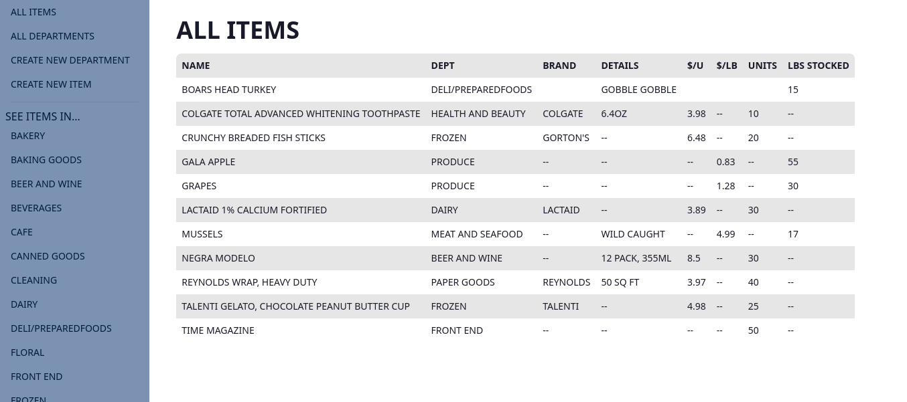

# Readme
# SuperGroceries Inventory System

## Overview

An inventory system for a supermarket which allows CRUD operations for the supermarket's products 
and departments.  This is a multi-page app built with MongoDB & Mongoose, Express, and Node.js.  
EJS was chosen as the templating engine, and Tailwind CSS along with DaisyUI were used as a 
front-end framework.  Heroku was chosen for the hosting of the server.  In addition to the main 
application, I wrote a script to populate the database with some sample items and departments,
which should be apparent if you visit the application.

### Screenshot

  

### Links

- [Live site](https://supermarket-inventory.herokuapp.com/)
- [Repo](https://github.com/mattdimicelli/Express_MongoDB_Supermarket_Inventory_2)

## My process

### Built with

- Form validation on the front-end (via HTML's built-in validation) and the back-end (via built-in and custom Mongoose schema validators)
- Structured per the Model-View-Controller (MVC) paradigm, as well as per Express-generator
- The HTML is 100% custom-made.  Much of the DaisyUI elements have custom modifications to the CSS
- Modern use of async/await for asynchronous code
- Custom-made npm scripts
- Other third-party modules, such as Helmet for enhanced security

### What I learned

Note for improvement: when deploying this site, I discovered that Heroku's free tier does not provide
a static IP address.  This is problematic in regards to MongoDB since MongoDB requires that 